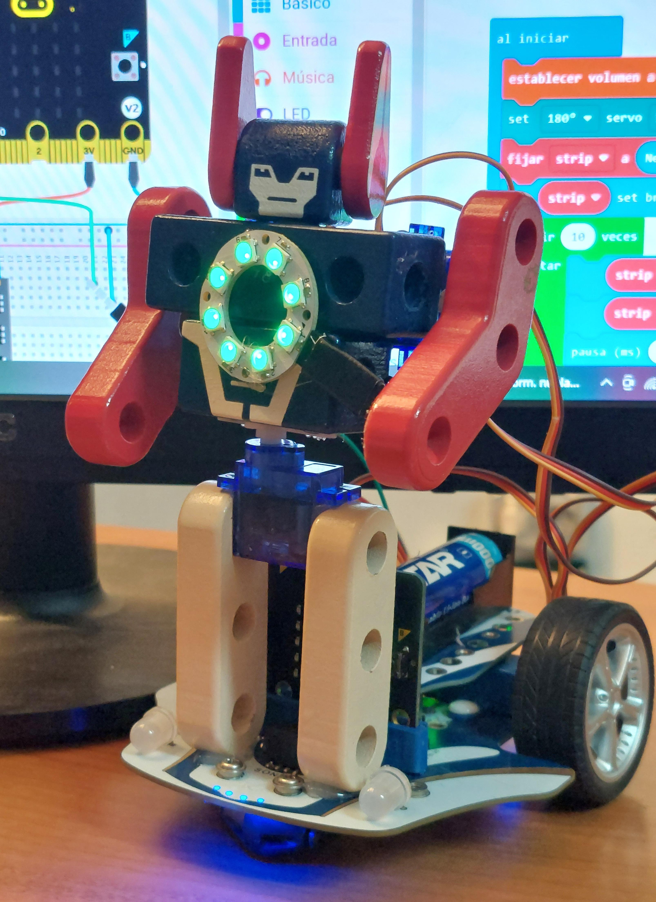

# RobotToy
In this project I will show you how to convert a simple 10$ wooden or plastic robot in a robot toy with two arms and a waist with one degree of freedom (DOF) and a nice 8 leds rings placed over a programmable robot car directed by a joystick.

It is a nice and affordable project to introduce robotic basics to our kids.

